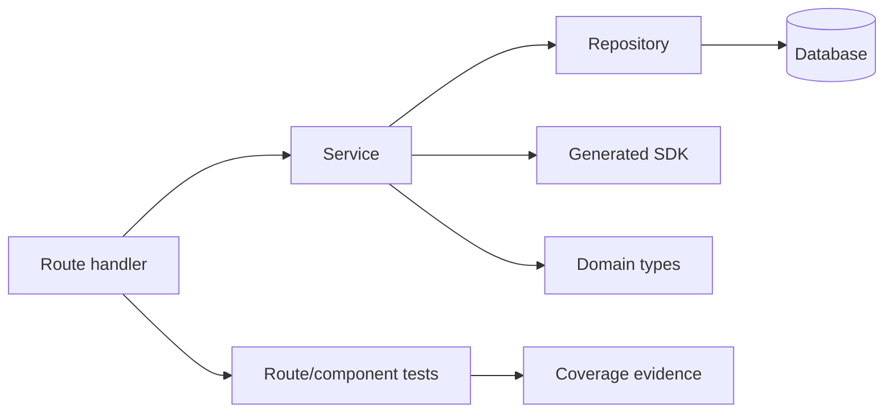

# INSIGHT 29: Fact Models Make Static Rules Agent-Usable

Static analysis for AI agents should not stop at "grep the AST." The useful
product is a fact model: files, imports, symbols, references, types, call edges,
control flow, dataflow, tests, coverage, generated-code markers, and ownership
metadata exposed through stable APIs.

The reason is practical. Agents fail at repo work when relationships are hidden.
A fact model makes relationships queryable and diagnostics repairable.

This insight is the bridge from the blog/talk argument into the `polint` /
`exlint` line of thinking. It belongs in this repo because the article needs the
principle, not a product document.

## Source map

| Ref     | Source                           | Local text                                                    | Role in this insight                                                                         |
| ------- | -------------------------------- | ------------------------------------------------------------- | -------------------------------------------------------------------------------------------- |
| R30     | GraphCodeBERT                    | `paper-text/graphcodebert-2009.08366.txt`                     | Early evidence that data-flow structure is useful for code representation.                   |
| R43     | Type-Constrained Code Generation | `paper-text/type-constrained-codegen-2504.09246.txt`          | Type facts reduce invalid generated code.                                                    |
| R49     | Chunking RAG Code Completion     | `paper-text/chunking-rag-code-completion-2605.04763.txt`      | Context units need declarations/neighborhoods, not isolated functions only.                  |
| R51     | ToolGen                          | `paper-text/toolgen-autocomplete-repo-codegen-2401.06391.txt` | Available-symbol tooling reduces dependency/static-validity failures.                        |
| R54     | CodeGRAG                         | `paper-text/codegrag-2405.02355.txt`                          | AST/control-flow/data-flow graph views bridge text and code structure.                       |
| R55     | InlineCoder                      | `paper-text/inlinecoder-context-inlining-2601.00376.txt`      | Call-graph neighborhoods supply dependency-aware context.                                    |
| R62     | CrossCodeEval                    | `paper-text/crosscodeeval-2310.11248.txt`                     | Cross-file API context materially improves repository completion.                            |
| R63     | CatCoder                         | `paper-text/catcoder-2406.03283.txt`                          | Code and type context improve repository-level Java/Rust generation.                         |
| R64     | A3-CodGen                        | `paper-text/a3-codgen-2312.05772.txt`                         | Local/global/library-aware API retrieval helps, but over-retrieval hurts.                    |
| D31-D33 | polint docs                      | `articles/polint-*.md`                                        | Local framework evidence for typed facts, diagnostics, baselines, and agent-oriented output. |

## The static-analysis ladder

For the article, "static analysis" should not mean one thing. It is a ladder of
fact families, each enabling different kinds of agent feedback.

| Layer               | Fact family                                               | Example agent-facing rule                                    |
| ------------------- | --------------------------------------------------------- | ------------------------------------------------------------ |
| File discovery      | paths, globs, generated/vendor status                     | Do not edit generated output; scope checks to app code.      |
| Syntax              | literals, imports, declarations, JSX attributes, branches | Ban raw colors, forbidden imports, missing route middleware. |
| Metrics             | LOC, complexity, function size, assertion counts          | Detect complexity spikes in agent changes.                   |
| Module graph        | resolved imports, package exports, dependency direction   | Enforce architecture boundaries and public APIs.             |
| Symbols/references  | definitions, references, re-exports                       | Migration completeness and dead public surface checks.       |
| Type facts          | checker facts, public API shape, generated SDK models     | Ban invalid/raw API calls and enforce contract usage.        |
| CFG                 | basic blocks, returns, throws, loops, branches            | Resource cleanup, branch obligations, postconditions.        |
| Dataflow            | def-use, validation-before-use, source/sink               | Input validation and taint-like policies.                    |
| Call graph          | direct/indirect calls and callbacks where known           | Route-to-service-to-repository path checks.                  |
| Test/coverage facts | test names, assertions, coverage reports                  | Evidence that risky branches or route handlers are tested.   |

This table is important because it prevents two bad simplifications:

- "Just write a custom lint rule." Some rules need symbols, types, or dataflow.
- "Just give the agent the AST." Raw parser output is too low-level and too
  unstable for normal rule authors and agents.

## Cross-file API context is a fact-model problem

CrossCodeEval constructs examples where the current file is not enough. The
completion target often depends on imports, definitions, usages, and symbols in
other files.

### CrossCodeEval data copied from the paper

| Measurement                                            |        Value |
| ------------------------------------------------------ | -----------: |
| Examples                                               | about 10,000 |
| Repositories                                           |  about 1,000 |
| Languages                                              |            4 |
| Python examples                                        |        2,665 |
| Java examples                                          |        2,139 |
| TypeScript examples                                    |        3,356 |
| C# examples                                            |        1,768 |
| References with names needing cross-file information   |  almost 100% |
| References predictable from current-file context alone |     about 2% |

### CrossCodeEval retrieval data copied from the paper

| Setting                                              | Exact match |
| ---------------------------------------------------- | ----------: |
| StarCoder-15.5B Python, in-file only                 |       8.82% |
| StarCoder-15.5B Python, retrieved context            |      15.72% |
| StarCoder-15.5B Python, reference-assisted retrieval |      21.01% |
| GPT-3.5-turbo C#, in-file only                       |       3.56% |
| GPT-3.5-turbo C#, with cross-file context            |      11.82% |

Source trace: R62, `paper-text/crosscodeeval-2310.11248.txt`.

The immediate inference: imports, declarations, public exports, and references
are not secondary metadata. They are the minimum fact model for repository
completion. Agents need the same relationships static analysis computes.

## Type and symbol facts reduce the API hallucination surface

Type-Constrained Code Generation, CatCoder, and ToolGen triangulate the same
point from different methods: visible legal surfaces improve generated code.

### Type and tool data copied from the papers

| Source                           |                                               Data point | Fact-model implication                           |
| -------------------------------- | -------------------------------------------------------: | ------------------------------------------------ |
| Type-Constrained Code Generation | 94% of generated TS compile errors are type-check errors | Type facts matter beyond syntax.                 |
| Type-Constrained Code Generation |             compile errors -74.8% on HumanEval synthesis | Type constraints reduce invalid code.            |
| Type-Constrained Code Generation |                  compile errors -56.0% on MBPP synthesis | Same direction on another benchmark.             |
| CatCoder                         |                 Java pass@k up to +17.35% over RepoCoder | Type/code context improves repo generation.      |
| CatCoder                         |              Java compile@k up to +14.44% over RepoCoder | Type/code context helps validity.                |
| ToolGen                          |                          Dependency coverage +31.4-39.1% | Accessible symbols reduce dependency mistakes.   |
| ToolGen                          |                              Static validity +44.9-57.7% | Static tools reduce invalid identifiers/members. |
| A3-CodGen                        |    global retrieval F1 k=5 0.601, k=10 0.526, k=15 0.479 | Curated API candidates beat unbounded context.   |

Source traces: R43, R51, R63, R64.

This makes generated SDKs and public API surfaces part of static-analysis
design. A "no raw internal API call" rule is simple only if the analyzer knows
what a raw call is, what the generated client is, and how imports resolve.

## Graph facts: callers, callees, control flow, and data flow

The graph papers are the deeper end of the ladder. They do not all evaluate the
same task, so the article should not merge their scores into one leaderboard.
Their shared mechanism is still useful: code is relational.

| Graph view               | Source signal                                                  | Practical use                                          |
| ------------------------ | -------------------------------------------------------------- | ------------------------------------------------------ |
| Data flow                | GraphCodeBERT uses data-flow structure for code representation | Track variables, definitions, and value movement.      |
| AST / CFG / DFG          | CodeGRAG builds graph views for retrieval-augmented generation | Retrieve structural neighborhoods, not raw text blobs. |
| Call graph               | InlineCoder inlines caller/callee context                      | Supply dependencies around the current edit.           |
| Requirement + code graph | GraphCodeAgent dual graph retrieval                            | Map task requirements to relevant code relationships.  |
| Repository graph         | RepoGraph / Repository Intelligence Graph                      | Expose build/test/dependency topology.                 |

This is why an agent-friendly static analyzer should expose scoped graph
queries, not dump a whole AST or whole repository graph into context. The rule
author and the agent need a neighborhood:



## Typed fact views are better than arbitrary rule-body guessing

The local `polint`/`exlint` research direction is relevant because it turns this
into an API design question. A rule should request the facts it needs. The
engine should know those facts before analysis so it can plan work, validate
setup, cache correctly, and explain unsupported capabilities.

Bad shape:

```rust
fn rule(ctx: &RuleCtx) {
    // rule can secretly read anything from a broad database
}
```

Better shape:

```rust
fn no_raw_api_calls(
    ctx: &mut RuleCtx<'_>,
    imports: Imports<'_>,
    strings: StringLiterals<'_>,
    // future:
    // resolved_imports: ResolvedImports<'_>,
    // symbols: Symbols<'_>,
    // types: TypeFacts<'_>,
) -> RuleResult {
    // the function signature is the fact contract
}
```

The insight for the blog is tool-agnostic: make the rule's data needs explicit.
This matters because agent-facing diagnostics are only trustworthy when the
analyzer can say which facts were exact, which were heuristic, and which were
unavailable due to missing setup.

## Precision tiers should be visible

Not all facts are equally strong.

| Precision tier       | Example                                       | Diagnostic language                                     |
| -------------------- | --------------------------------------------- | ------------------------------------------------------- |
| Exact syntax         | raw string literal, direct import path        | "Found this literal/import."                            |
| Resolved syntax      | import resolves to forbidden internal package | "Import resolves to forbidden module."                  |
| Heuristic structure  | branch appears untested by naming convention  | "No local test evidence found."                         |
| Semantic/type-backed | call violates generated client contract       | "Call does not match approved typed API surface."       |
| Cross-file inferred  | migration appears incomplete                  | "This appears inconsistent with the migration pattern." |

This is not just academic caution. Agents optimize against the feedback they
receive. If a heuristic warning is written like a proof, the agent may make
weird changes to satisfy it. If an exact violation is written too vaguely, the
agent may miss an easy fix.

## What this does not prove

It does not prove every codebase needs a custom static-analysis framework.
Existing tools cover many common cases.

It does not prove deeper facts are always better. A3-CodGen and chunking
research both warn against indiscriminate context expansion. Fact models should
enable selective queries, not maximal dumps.

It does not prove graph analysis is needed for every rule. Many useful rules
are syntax-only. The point is to avoid pretending syntax-only rules are the
whole architecture surface.

## Blog visual candidates

1. Static-analysis ladder: syntax -> module graph -> symbols -> types -> CFG ->
   dataflow -> call graph -> tests/coverage.
2. Rule fact contract example: function parameters as capability declaration.
3. Precision-tier table.
4. CrossCodeEval exact-match chart: in-file vs retrieved vs reference-assisted.
5. Relationship neighborhood graph: route -> service -> repo -> SDK -> tests.

## References

- R30: GraphCodeBERT, `paper-text/graphcodebert-2009.08366.txt`
- R43: Type-Constrained Code Generation,
  `paper-text/type-constrained-codegen-2504.09246.txt`
- R49: Chunking RAG Code Completion,
  `paper-text/chunking-rag-code-completion-2605.04763.txt`
- R51: ToolGen, `paper-text/toolgen-autocomplete-repo-codegen-2401.06391.txt`
- R54: CodeGRAG, `paper-text/codegrag-2405.02355.txt`
- R55: InlineCoder, `paper-text/inlinecoder-context-inlining-2601.00376.txt`
- R62: CrossCodeEval, `paper-text/crosscodeeval-2310.11248.txt`
- R63: CatCoder, `paper-text/catcoder-2406.03283.txt`
- R64: A3-CodGen, `paper-text/a3-codgen-2312.05772.txt`
- D31-D33: polint docs,
  `articles/polint-readme.md`,
  `articles/polint-agent-playbook.md`,
  `articles/polint-ignore-comments.md`
