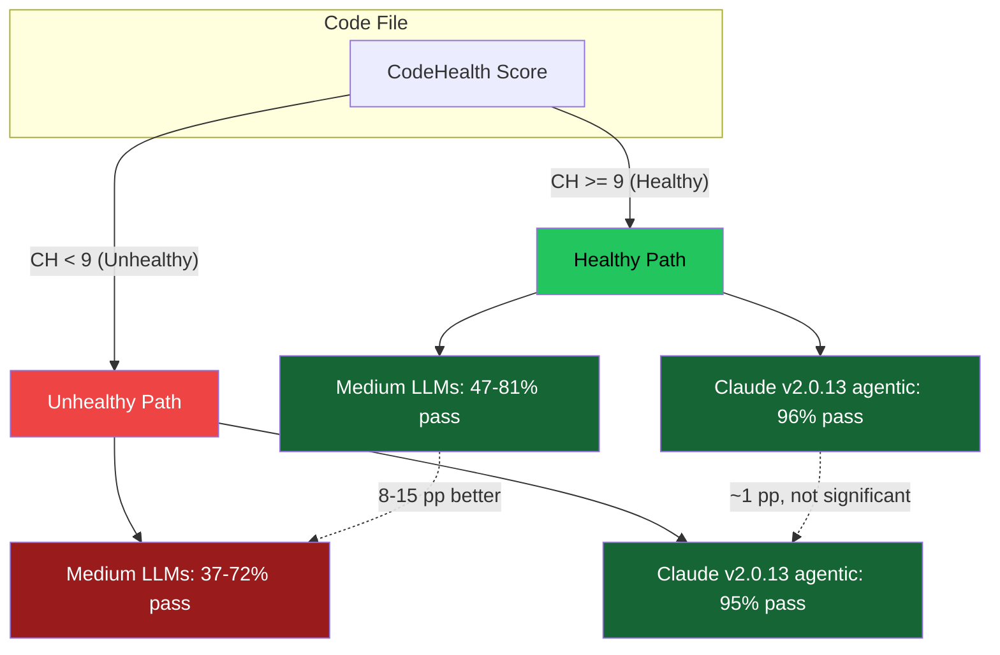
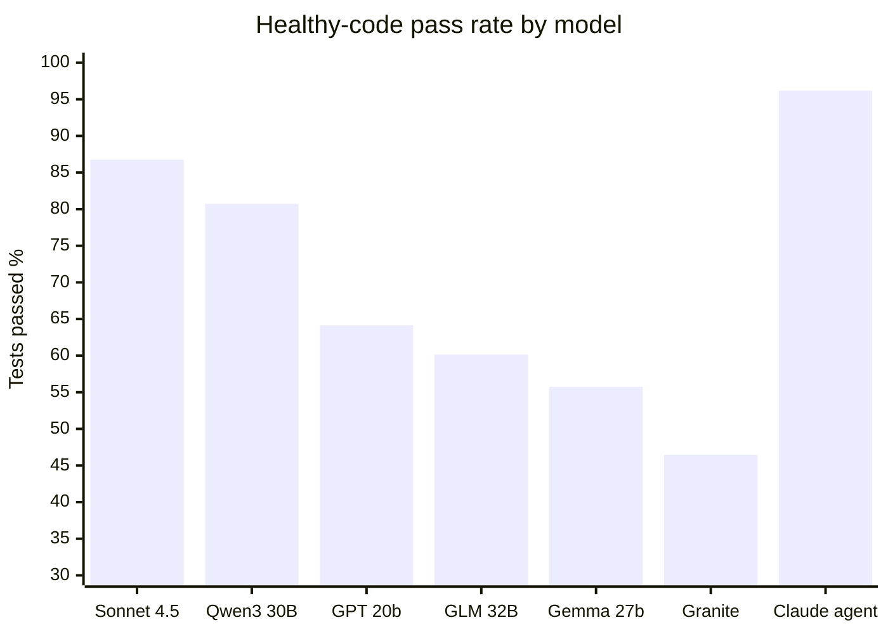
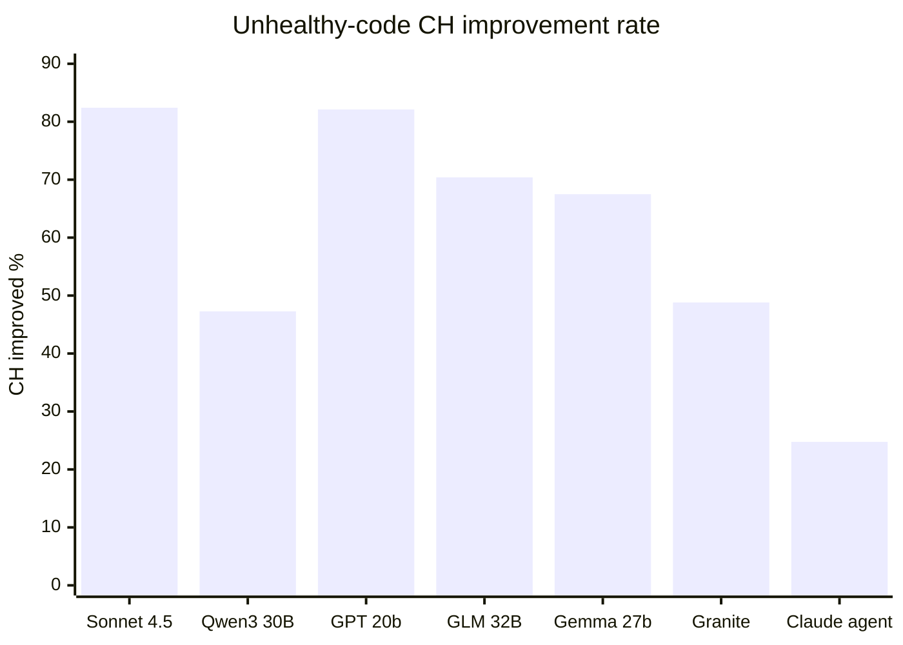

# INSIGHT 30: CodeHealth Predicts AI Refactoring Success

File-level code quality, measured by CodeScene's CodeHealth metric, is a
statistically significant predictor of whether an LLM will successfully refactor
code without breaking tests. For five medium-sized open-weight models, healthy
code (CH >= 9) reduced refactoring break rates by 8-15 percentage points. In
decision-tree classifiers, CodeHealth was the root node for every model tested,
with feature importance ranging from 0.572 to 0.880. The frontier agentic
system (Claude) achieved 94-96% pass rates regardless of code health, but with
the most conservative refactoring behavior -- leaving 61-69% of files' CH
unchanged.

This is the strongest direct empirical link between traditional code quality
metrics and AI agent performance published to date. It validates the thesis of
this presentation: the same code properties that help human maintainers also
help AI agents. The paper's own conclusion: "human-friendly code is more
amenable to AI interventions."

A companion RCT ("Echoes of AI") from the same research group found no
systematic maintainability difference when code is co-developed with AI
assistants, closing the loop: AI does not make code worse (Echoes), but AI
performs worse on already-bad code (Code for Machines).

## Source map

| Ref | Source                                                 | Local file                                            | Role in this insight                                                                                                                         |
| --- | ------------------------------------------------------ | ----------------------------------------------------- | -------------------------------------------------------------------------------------------------------------------------------------------- |
| R77 | Code for Machines, Not Just Humans (Borg et al., 2026) | `papers/code-for-machines-2601.02200.pdf`             | Primary source. Dataset, experiment, all quantitative results on CH and refactoring.                                                         |
| R78 | Echoes of AI (Borg et al., 2025)                       | `papers/echoes-of-ai-2507.00788.pdf`                  | Complementary RCT: AI-assisted code shows no systematic maintainability difference, but code quality still matters for AI refactoring tasks. |
| R59 | Smells of LLM Generated Code                           | `paper-text/smells-llm-generated-code-2510.03029.txt` | Cross-reference: LLM-generated code carries more smells than professional code; aligns with CH detecting smells.                             |
| R72 | CODETASTE                                              | `paper-text/codetaste-2603.04177.txt`                 | Cross-reference: refactoring evaluation combining tests with static rules.                                                                   |
| R71 | Constraint Decay                                       | `paper-text/constraint-decay-2605.06445.txt`          | Cross-reference: structural constraints reduce LLM success by ~30 pp.                                                                        |

---

## Paper discussion: "Code for Machines, Not Just Humans"

### Authors and affiliation

Markus Borg, Nadim Hagatulah, Adam Tornhill, Emma Soderberg. CodeScene and Lund
University. Borg is lead author on both this paper and the "Echoes of AI" study.
Tornhill founded CodeScene and developed the CodeHealth metric. The dual
affiliation is relevant: CodeScene has a commercial interest in demonstrating the
value of CodeHealth, though the methodology is transparent and the dataset is
publicly available.

### CodeHealth metric

CodeHealth (CH) is a file-level code quality metric developed by CodeScene,
scored on a scale of 1-10. It detects 25 code smells for Python. Thresholds:

- CH >= 9: Healthy
- 4 <= CH < 9: Warning
- CH < 4: Alert

The metric is proprietary, which is a limitation for reproducibility. However,
the code smells it detects are well-documented and standard: god classes, deeply
nested logic, duplicated code, complex methods, excessive function arguments,
complex conditionals, etc. Other static analysis tools detect many of the same
smells, though the aggregation into a single 1-10 score is specific to
CodeScene.

### The nine code smells found in the dataset

The 5,000-file dataset yielded these nine code smells (counts are per-file
occurrences; files can have multiple smells):

| Code smell                   | Count |
| ---------------------------- | ----: |
| Bumpy Road Ahead             | 4,901 |
| Complex Method               | 3,572 |
| Deep, Nested Complexity      | 2,433 |
| Complex Conditionals         | 1,328 |
| Excessive Function Arguments |   724 |

Note: only the top 5 by count are listed above from the extracted data. The
remaining four smells were not individually enumerated in the paper sections I
extracted. These are standard structural code smells that align with what many
linters and complexity checkers detect. The important point: these are not exotic
metrics. They are the same things teams already check (or should check) for human
maintainability.

---

## Dataset construction pipeline (9 steps)

The dataset construction is unusually rigorous for this kind of study. The full
pipeline, from the paper's Section 3.1:

1. **Download full CodeContests dataset**: 13,210,440 solutions from Google
   DeepMind's competitive programming archive.
2. **Filter to Python 3 only**: 1,502,532 solutions remain.
3. **Remove all identical Type 1 clones**: 1,390,531 solutions remain. Type 1
   clones are exact textual duplicates.
4. **Remove all solutions with no CodeScene code smell**: 88,156 solutions
   remain. This is a critical filter -- it ensures every file in the dataset has
   at least one detectable quality issue, so the refactoring task is meaningful.
5. **Strip comments and unbound string literals**: Removes noise that could
   inflate SLOC counts or distort perplexity measurements.
6. **Filter to 60-120 SLOC**: 18,074 solutions remain. This range was chosen to
   ensure files are large enough to contain meaningful structure but small enough
   for single-file refactoring.
7. **Partition into Healthy (CH >= 9) and Unhealthy (CH < 9) strata**.
8. **For each stratum, sample 2,500 using diversity sampling**:
   a. Sample a random candidate solution.
   b. Run its test cases; skip if any test fails (ensures all files are
   initially correct).
   c. Compute CodeBLEU similarity to existing samples in the stratum; skip if
   similarity >= 0.9 (ensures diversity).
   d. Add to stratum.
9. **Merge the two strata**: final dataset is 5,000 files (2,500 Healthy, 2,500
   Unhealthy).

**Important footnote**: Footnote 3 in the paper notes "a minor threshold-
specification issue in the sampling script" where CH = 9 was treated as
Unhealthy during sampling. All analyses in the paper use the intended convention
(Healthy >= 9). This means a small number of files at exactly CH = 9 may be in
the Unhealthy stratum. The authors state this does not materially affect results.

The 50/50 stratification is artificial. Real codebases have different CH
distributions, likely skewed toward Warning territory. This design choice
maximizes statistical power for detecting differences between Healthy and
Unhealthy groups but means the absolute numbers cannot be directly projected to
a specific production codebase without knowing that codebase's CH distribution.

---

## Models tested

Seven models total, tested at two capability tiers:

| Model                             | Provider  | Date     | Size class       | N (files) |
| --------------------------------- | --------- | -------- | ---------------- | --------: |
| Gemma gemma-3-27b-it              | Google    | Mar 2025 | Medium (27B)     |     5,000 |
| GLM GLM-4-32B-0414                | Zhipu AI  | Apr 2025 | Medium (32B)     |     5,000 |
| GPT gpt-oss-20b                   | OpenAI    | Aug 2025 | Medium (20B)     |     5,000 |
| Granite Granite-4.0-H-Small       | IBM       | Oct 2025 | Medium           |     5,000 |
| Qwen Qwen3-Coder-30B-A3B-Instruct | Alibaba   | Aug 2025 | Medium (30B)     |     5,000 |
| Sonnet claude-sonnet-4-5-20250929 | Anthropic | Sep 2025 | Frontier         |     1,000 |
| Claude v2.0.13 (agentic)          | Anthropic | --       | Frontier/Agentic |     1,000 |

The power asymmetry between medium-sized (N=5,000) and frontier (N=1,000) runs
is a recognized internal validity threat. The smaller sample for Sonnet and
Claude reduces statistical power for detecting smaller effects.

---

## Exact refactoring prompts

### Medium-sized LLMs (Gemma, GLM, GPT, Granite, Qwen)

From page 4 of the paper, the exact prompt given to the five medium-sized LLMs:

````
(A) Act as an expert software engineer. (B) Your task is to refactor the
following Python code for maintainability and clean code. (C) Respond ONLY with
the complete, refactored Python code block. Do not add any explanations,
comments, or introductory sentences. (D) Original code to refactor:
``` python <CODE> ```
````

Generation settings: Temperature 0.7, max 8,192 new tokens, all other settings
at defaults.

### Sonnet

Sonnet (claude-sonnet-4-5-20250929) received the same prompt as the medium-sized
LLMs, with the same generation settings. It was run as a standard LLM call, not
in agentic mode.

### Claude (agentic)

Claude (v2.0.13) was run differently -- in agentic mode in terminal, with a
CLAUDE.md file containing: "Each file in this folder is independent; you do not
have to worry about dependencies between them." Configuration:

- Model: `claude-sonnet-4-5-20250929` (same underlying model as Sonnet)
- Bash/WebFetch/WebSearch: disabled
- MCP: none
- Files organized in batches of 20, then 200, 400, 380
- Instruction: "Refactor the Python files in this folder for maintainability."

This is a critical methodological detail. Claude and Sonnet use the same
underlying model, but Claude runs in agentic mode with tool use, file system
access, and batch processing. The differences in behavior (Claude is far more
conservative) emerge entirely from the agentic scaffold, not from model
capability. This has implications for how agentic setups interact with code
quality.

---

## RQ2: Refactoring break rates by CodeHealth group

This is the central result. The refactoring task: given a Python file, refactor
it to improve quality while preserving behavior. Success = all original tests
still pass after refactoring.

### Table 2 -- Refactoring break rates (copied from the paper)

| Model   | Group     | Total | Tests Passed N | Tests Passed % | p (chi-sq) | RD (pp) [95% CI]        | RR [95% CI]          |
| ------- | --------- | ----: | -------------: | -------------: | ---------: | ----------------------- | -------------------- |
| Sonnet  | Healthy   |   499 |            433 |          86.77 |      0.439 | -2.74 [-7.11, 1.63]     | 0.828 [0.613, 1.120] |
| Sonnet  | Unhealthy |   501 |            421 |          84.03 |            |                         |                      |
| Qwen    | Healthy   |  2501 |           2019 |          80.72 |     <0.001 | -8.58 [-10.92, -6.24]   | 0.692 [0.625, 0.766] |
| Qwen    | Unhealthy |  2499 |           1803 |          72.16 |            |                         |                      |
| GPT     | Healthy   |  2501 |           1604 |          64.13 |     <0.001 | -11.15 [-13.87, -8.44]  | 0.763 [0.713, 0.816] |
| GPT     | Unhealthy |  2499 |           1324 |          52.98 |            |                         |                      |
| GLM     | Healthy   |  2501 |           1504 |          60.14 |     <0.001 | -10.16 [-12.90, -7.41]  | 0.797 [0.749, 0.848] |
| GLM     | Unhealthy |  2499 |           1249 |          50.02 |            |                         |                      |
| Gemma   | Healthy   |  2501 |           1394 |          55.74 |     <0.001 | -15.12 [-17.86, -12.38] | 0.745 [0.706, 0.787] |
| Gemma   | Unhealthy |  2499 |           1015 |          40.58 |            |                         |                      |
| Granite | Healthy   |  2501 |           1162 |          46.46 |     <0.001 | -9.29 [-12.01, -6.56]   | 0.852 [0.813, 0.894] |
| Granite | Unhealthy |  2499 |            929 |          37.17 |            |                         |                      |
| Claude  | Healthy   |   499 |            480 |          96.19 |      0.439 | -1.38 [-3.95, 1.19]     | 0.734 [0.411, 1.308] |
| Claude  | Unhealthy |   501 |            475 |          94.81 |            |                         |                      |

Units: Tests Passed % is percentage. RD is risk difference in percentage points.
RR is relative risk ratio.

### Key observations from refactoring break rates

1. All five medium-sized LLMs show statistically significant lower break rates
   on healthy code (p < 0.001 for all).
2. Risk difference ranges from -8.58 pp (Qwen) to -15.12 pp (Gemma).
3. In relative terms, break-rate risk reduction is 15-30% on healthy code.
4. Sonnet (p=0.439) and Claude (p=0.439) show no significant difference between
   healthy and unhealthy code. Both have high absolute pass rates (84-96%).
5. Claude as agentic SotA achieves 94-96% pass rates regardless of code health.
   This suggests frontier agentic systems can compensate for code quality issues,
   but medium-sized models cannot.

### Frontier vs medium-sized model comparison

This split is important for the talk. The implication is:

- If you use frontier agentic systems (Claude, top-tier Sonnet), your code
  quality matters less for immediate refactoring success.
- If you use medium-sized models (which are common in cost-sensitive, latency-
  sensitive, or offline workflows), code quality becomes a significant predictor
  of success.
- The practical question for most organizations: you will not always use the
  most expensive frontier model. Your CI, your batch processing, your
  autocomplete, and your cost-optimized pipelines will use smaller models.
  Code quality matters for those.

---

## Table 3: What refactorings do to CodeHealth (full data)

The paper reports CH deltas partitioned as increase (CH up), no change (CH
same), and decrease (CH down), plus %Success = CH improved AND tests pass. This
is the complete Table 3 from the paper.

### Full Table 3 -- CH deltas for ALL models (copied from the paper)

| Model   | Group     | Total | Tests Passed N | Tests Passed % | CH up |   CH up % | CH same | CH same % | CH down | CH down % | %Success |
| ------- | --------- | ----: | -------------: | -------------: | ----: | --------: | ------: | --------: | ------: | --------: | -------: |
| Sonnet  | Healthy   |   499 |            433 |          86.77 |   250 | **57.74** |      69 |     15.94 |     114 |     26.33 |    50.10 |
| Sonnet  | Unhealthy |   501 |            421 |          84.03 |   347 | **82.42** |      30 |      7.13 |      44 |     10.45 |    69.26 |
| Qwen    | Healthy   |  2501 |           2019 |          80.72 |   539 |     26.71 |     934 | **46.28** |     545 |     27.01 |    21.56 |
| Qwen    | Unhealthy |  2499 |           1803 |          72.16 |   853 | **47.28** |     581 |     32.21 |     370 |     20.51 |    34.12 |
| GPT     | Healthy   |  2501 |           1604 |          64.12 |   961 | **59.95** |     305 |     19.03 |     337 |     21.02 |    38.44 |
| GPT     | Unhealthy |  2499 |           1324 |          53.00 |  1088 | **82.11** |     107 |      8.08 |     127 |      9.58 |    43.52 |
| GLM     | Healthy   |  2501 |           1504 |          60.14 |   679 | **45.18** |     414 |     27.54 |     410 |     27.29 |    27.16 |
| GLM     | Unhealthy |  2499 |           1249 |          50.00 |   880 | **70.40** |     158 |     12.64 |     212 |     16.96 |    35.20 |
| Gemma   | Healthy   |  2501 |           1394 |          55.76 |   627 | **44.98** |     426 |     30.56 |     341 |     24.46 |    25.08 |
| Gemma   | Unhealthy |  2499 |           1015 |          40.60 |   685 | **67.49** |     162 |     15.96 |     168 |     16.55 |    27.40 |
| Granite | Healthy   |  2501 |           1162 |          46.44 |   417 |     35.90 |     540 | **46.52** |     204 |     17.58 |    16.68 |
| Granite | Unhealthy |  2499 |            929 |          37.17 |   454 | **48.82** |     347 |     37.31 |     129 |     13.87 |    18.16 |
| Claude  | Healthy   |   499 |            480 |          96.19 |    96 |     20.00 |     331 | **68.96** |      53 |     11.04 |    19.24 |
| Claude  | Unhealthy |   501 |            475 |          94.81 |   124 |     24.75 |     288 | **60.63** |      63 |     13.26 |    24.75 |

Units: Bold percentages indicate the dominant CH delta category for each
model/group. %Success = percentage of total files where CH improved AND tests
passed. CH up/same/down percentages are computed over tests-passed files only.

### Key patterns in the CH delta table

1. **Sonnet and GPT are the most aggressive refactorers.** 57-82% of their
   passing refactorings improve CH. They actively restructure code. GPT is
   particularly aggressive on Unhealthy code (82.11% CH up).

2. **Claude is the most conservative.** 69% of healthy-code refactorings leave
   CH unchanged. Even on Unhealthy code, 61% are left unchanged. The agentic
   scaffold appears to make Claude cautious -- it touches less code.

3. **Qwen and Granite frequently leave CH unchanged.** Granite on Healthy code
   has 46.52% unchanged, Qwen 46.28%. These models are less likely to attempt
   significant structural changes.

4. **On Unhealthy code, all models more frequently improve CH.** The smells are
   more obvious, and there is more room for improvement. This is expected: a
   file at CH 5 has more detectable issues than a file at CH 9.5.

5. **%Success (improved CH + tests pass) is highest for Sonnet Unhealthy
   (69.26%) and lowest for Granite Healthy (16.68%).** This metric combines
   both dimensions: the model must improve quality AND preserve correctness.

6. **CH worsening is non-trivial.** Sonnet worsens CH in 26.33% of Healthy
   refactorings. GPT worsens 21.02%. Even "successful" refactorings (tests
   pass) can degrade code quality. This is an underappreciated risk: an AI
   refactoring that passes tests but introduces smells is a net negative.

### Claude vs Sonnet: same model, different behavior

This comparison is methodologically significant. Both use
claude-sonnet-4-5-20250929. The differences:

| Metric                               | Sonnet (standard) | Claude (agentic) |
| ------------------------------------ | ----------------- | ---------------- |
| Pass rate, Healthy                   | 86.77%            | 96.19%           |
| Pass rate, Unhealthy                 | 84.03%            | 94.81%           |
| CH improved, Healthy                 | 57.74%            | 20.00%           |
| CH improved, Unhealthy               | 82.42%            | 24.75%           |
| CH unchanged, Healthy                | 15.94%            | 68.96%           |
| CH unchanged, Unhealthy              | 7.13%             | 60.63%           |
| %Success (improve + pass), Healthy   | 50.10%            | 19.24%           |
| %Success (improve + pass), Unhealthy | 69.26%            | 24.75%           |

The agentic scaffold trades improvement aggressiveness for safety. Claude breaks
far fewer tests but also improves far fewer files. Whether this trade-off is
desirable depends on the use case. For CI-integrated refactoring where test
breakage is costly, Claude's conservatism is valuable. For batch code quality
improvement where you want maximum uplift, Sonnet's aggressiveness yields higher
%Success.

---

## Claude agentic behavior analysis (Appendix B)

The paper's Appendix B provides two output examples showing Claude's refactoring
range.

### Conservative refactoring example

Claude performs: descriptive naming (a,b,c -> array, l, n, m), organized
imports, constants moved to top of file, proper spacing, all logic preserved
exactly. Claude's own statement: "Zero functionality changes -- all algorithms
work identically."

### Bolder refactoring example

Claude performs: improved naming, code structure extraction, PEP 8 compliance,
code smell removal (magic numbers replaced with named constants, complex
conditionals simplified, duplicate code eliminated, deeply nested structures
flattened), function decomposition, single responsibility principle. Claude's own
statement: "Each file maintains its original functionality while being
significantly more readable and maintainable."

### The overconfidence observation

The paper notes: "We did not find any pattern in when Claude chooses conservative
versus bolder refactoring attempts. At the same time, we observe that Claude's
statements about 'zero functionality changes' and 'file maintains its original
functionality' are overconfident -- sometimes the agent indeed breaks behavior."

This is important. Claude's self-reported confidence in preservation is not
reliable. The 4-5% break rate (1 - 96%/95%) comes despite Claude's own
assertions of correctness. This aligns with known issues in LLM self-evaluation:
models are generally poor judges of whether their own outputs preserve
semantics.

---

## RQ3: Predictive power of CodeHealth

Decision tree classifiers were trained to predict refactoring failure from three
features: CodeHealth, perplexity, and SLOC.

### Table 4 -- Decision tree results (copied from the paper)

| LLM     | %Break |   AUC | CH importance | PPL importance | SLOC importance |
| ------- | -----: | ----: | ------------: | -------------: | --------------: |
| Qwen    |  0.236 | 0.553 |     **0.707** |          0.160 |           0.132 |
| GPT     |  0.414 | 0.559 |     **0.683** |          0.268 |           0.049 |
| GLM     |  0.449 | 0.546 |     **0.572** |          0.360 |           0.068 |
| Gemma   |  0.518 | 0.565 |     **0.880** |          0.120 |          <0.001 |
| Granite |  0.582 | 0.544 |     **0.583** |          0.417 |          <0.001 |

Units: %Break is the fraction of files where refactoring broke tests. AUC is
area under the ROC curve. Importance values are feature importances from the
decision tree (sum to 1.0 per model).

### Decision tree CH thresholds per model

CodeHealth is the root node in ALL five decision trees. The per-model split
thresholds:

| Model   | CH threshold |   Fraction below threshold |
| ------- | -----------: | -------------------------: |
| Qwen    |     <= 8.895 |  63% (1163 fail, 848 pass) |
| GPT     |     <= 8.775 |  61% (1070 fail, 683 pass) |
| GLM     |     <= 9.195 | 55% (1495 fail, 1230 pass) |
| Gemma   |     <= 8.875 |   62% (866 fail, 572 pass) |
| Granite |     <= 8.285 |   60% (398 fail, 234 pass) |

Inference: the thresholds cluster around CH ~9, which is exactly the
Healthy/Warning boundary in the CodeScene scale. This is notable because the
CH=9 threshold was originally calibrated for human maintainability, not AI
performance. The convergence suggests that the same code properties that make
code hard for humans to maintain also make it hard for LLMs to safely refactor.

### Figure 2 -- Decision tree for Qwen (exact node values)

The full decision tree for Qwen, with exact sample counts and class values from
Figure 2 of the paper:

```
Root: codeHealth <= 8.895
  samples=5000, value=[2500.0, 2500.0], class=pass

Left child (CH <= 8.895):
  ppl <= 2.710, samples=1845, value=[1162.988, 848.378], class=fail

  Left-left (ppl <= 2.710):
    codeHealth <= 8.185, samples=1699, value=[1112.054, 768.577], class=fail
    Leaf (CH <= 8.185): samples=470, value=[275.637, 191.654], class=fail
    Leaf (CH > 8.185): samples=1229, value=[736.418, 576.923], class=fail

  Left-right (ppl > 2.710):
    sloc <= 80.5, samples=146, value=[50.934, 79.801], class=pass
    Leaf (sloc <= 80.5): samples=96, value=[21.222, 56.253], class=pass
    Leaf (sloc > 80.5): samples=50, value=[29.711, 23.548], class=fail

Right child (CH > 8.895):
  codeHealth <= 9.615, samples=3155, value=[1337.012, 1651.622], class=pass

  Right-left (CH <= 9.615):
    sloc <= 65.5, samples=2176, value=[1010.187, 1111.983], class=pass
    Leaf (sloc <= 65.5): samples=410, value=[228.813, 194.271], class=fail
    Leaf (sloc > 65.5): samples=1766, value=[770.374, 917.713], class=pass

  Right-right (CH > 9.615):
    ppl <= 1.57, samples=979, value=[326.625, 539.639], class=pass
    Leaf (ppl <= 1.57): samples=346, value=[89.134, 188.849], class=pass
    Leaf (ppl > 1.57): samples=633, value=[237.691, 340.791], class=pass
```

The tree shows: below CH 8.895, the model is already in "fail" territory by
default. Perplexity provides a secondary split but only rescues a small subset
(146 of 1845 files in the low-CH branch). Above CH 8.895, the model defaults to
"pass" and the remaining splits (by CH 9.615, then SLOC and PPL) provide
marginal refinement.

### Odds ratios from logistic regression

| Model   | Odds ratio per 1-SD CH increase (0.65) |
| ------- | -------------------------------------: |
| Qwen    |                                  1.347 |
| GPT     |                                  1.307 |
| GLM     |                                  1.215 |
| Gemma   |                                  1.420 |
| Granite |                                  1.240 |

Interpretation: a one-standard-deviation increase in CodeHealth (0.65 points)
raises the odds of successful refactoring by 20-42%, depending on model. Gemma
is most sensitive to code quality (42% increase), GLM least (22%). All are
statistically significant.

### AUC caveat

The AUC values are low (0.544-0.565). CodeHealth is the most important feature
but the model is not a strong classifier. This means CH is a useful risk
signal, not a reliable predictor. Many other factors influence refactoring
success. The article should frame this as: "CodeHealth explains more variance
than anything else we can measure at the file level, but it does not explain
most of the variance."

---

## Figure 3 -- Break rate trend across CodeHealth spectrum

The paper visualizes break rates as a function of CodeHealth across the full
1-10 range, not just the binary Healthy/Unhealthy split. The key finding from
Section 4.3:

"All LLMs exhibit a clear negative trend, i.e., refactorings on healthier code
break tests less often. We notice that this holds also for Sonnet, despite no
significant Healthy-Unhealthy difference for that LLM in RQ2. Instead, our
results indicate that more capable LLMs shift the threshold to lower values,
i.e., Sonnet's safer interval might begin around CH ~8. However, for the agentic
solution Claude, the most conservative refactoring approach under study, the
results show no clear trend."

This is a nuanced finding. The binary RQ2 analysis (Healthy vs Unhealthy) shows
no significant effect for Sonnet, but the continuous analysis shows a trend.
The binary test lacks power to detect a smaller effect that is present across the
full CH range. Sonnet still benefits from higher CH, just at a lower threshold
than the medium-sized models.

Claude's flat break-rate curve across CH values is consistent with its extreme
conservatism: if you barely change the code, you barely break tests, regardless
of the code's quality. The agentic scaffold's caution masks any underlying
sensitivity to code quality.

---

## Spearman correlations: SLOC and token count (Section 4.2)

### SLOC correlations with refactoring success

All models show negligible associations between SLOC and refactoring success
except GPT (rho = +0.197). SLOC is not a meaningful predictor of refactoring
outcome in this 60-120 SLOC range.

### Token count correlations with perplexity

Four models show small negative correlations between token count and perplexity:

| Model   | rho (token count vs PPL) |
| ------- | -----------------------: |
| Gemma   |                   -0.197 |
| GLM     |                   -0.245 |
| Granite |                   -0.242 |
| Qwen    |                   -0.223 |
| GPT     |                   +0.153 |

Interpretation from the paper: "LLMs' PPL on the code tends to decrease slightly
as token count increases." Longer files in this range tend to be slightly more
predictable for the model. GPT is the exception, showing the opposite trend.
All correlations are small and of limited practical significance.

---

## RQ1: Perplexity vs CodeHealth (negative result)

See INSIGHT_31 for full treatment. Summary: no practically meaningful
association between perplexity and CodeHealth at the file level. Effect sizes
negligible for all models. Perplexity measures token-level predictability, not
structural code quality. A deeply nested but syntactically conventional function
can have low perplexity and low CodeHealth simultaneously. This is discussed in
detail in the companion insight.

---

## Connection to "Echoes of AI" (R78) -- detailed quantitative results

The Borg group also ran a preregistered, two-phase sequential controlled
experiment studying whether AI-assisted code has worse maintainability than
human-only code. This section presents the full quantitative results.

### Study design

- **Design**: Preregistered, two-phase sequential controlled experiment
- **Enrollment**: 449 signed up, 151 completed tasks
- **Participant profile**: 92.2% professional developers, median age 40-49
- **Task**: Java web application feature addition

### Phase 1 (observational)

76 valid Task 1 solutions: 39 AI-dev (developed with AI assistance), 37 !AI-dev
(developed without AI). The task was adding a feature to a Java web application.

AI tools used by participants in the AI-dev group:

| Tool           | N participants |
| -------------- | -------------: |
| GitHub Copilot |             21 |
| ChatGPT        |             13 |
| Cursor         |              9 |
| JetBrains AI   |              5 |
| Claude         |              4 |
| Tailwind AI    |              2 |
| VS IntelliCode |              2 |

Important: "No instances of fully autonomous agents" -- all usage was
second-generation AI assistant (copilot/chat) usage, not agentic. This limits
generalizability to agentic workflows.

Task 1 completion time (Bayesian analysis): habitual AI users finished ~60%
faster. P(Delta<0) > 99%, credible interval [-77.11%, -30.64%]. This is a
strong signal but from self-selected habitual users, not randomized.

### Phase 2 (the RCT)

75 valid Task 2 solutions. The treatment group evolved AI-developed (Phase 1)
code; the control group evolved human-only (Phase 1) code. All Task 2
participants worked WITHOUT AI assistance. This is the clean causal test: does
the provenance of the code (AI-assisted vs not) affect how easy it is for a
human to evolve?

#### Completion time results

| Metric                  | Treatment                     | Control                       |
| ----------------------- | ----------------------------- | ----------------------------- |
| Median completion time  | 136 min (95% CI: 105.5-180.0) | 173 min (95% CI: 118.1-210.0) |
| Cliff's delta           | -0.079 (negligible)           |                               |
| Wilcoxon p-value        | 0.56 (NOT significant)        |                               |
| Bayesian P(Delta<0)     | 76%                           |                               |
| Bayesian posterior mean | -12.59%                       |                               |
| Bayesian CrI            | [-45.77%, +32.68%]            |                               |

Conclusion: "Both analyses are consistent with a null effect on Task 2
completion time." The wide credible interval means the study cannot rule out
either a moderate speedup or slowdown from evolving AI-developed code.

#### CodeHealth results

No significant differences in CodeHealth between treatment and control. The
abstract states: "We did not detect systematic maintainability advantages or
disadvantages when other developers evolved code co-developed with AI
assistants."

#### Perceived productivity results

| Metric                      | Treatment                | Control                  |
| --------------------------- | ------------------------ | ------------------------ |
| Mean perceived productivity | 3.95 (95% CI: 3.77-4.12) | 4.06 (95% CI: 3.88-4.24) |
| Cohen's d                   | -0.21 (small negative)   |                          |
| Welch's t-test p-value      | 0.37 (NOT significant)   |                          |

The small negative Cohen's d means treatment participants felt slightly less
productive, but the effect is not significant. The overlapping confidence
intervals confirm this.

### The key Echoes conclusion

"We did not detect systematic maintainability advantages or disadvantages when
other developers evolved code co-developed with AI assistants."

### Combined reading of both Borg papers

The two papers together make a coherent argument:

1. **Echoes of AI**: AI-assisted code is not inherently worse for
   maintainability. AI assistants (Copilot, ChatGPT) do not systematically
   degrade code quality. The code they help produce is roughly as maintainable
   as human-only code.

2. **Code for Machines**: But the quality of the code the AI works ON still
   matters for AI refactoring success. Low-CH code is harder for AI to refactor
   safely, especially for medium-sized models.

These are compatible findings. The first says AI does not make code worse. The
second says AI performs worse on already-bad code. Together: the starting
quality of your codebase matters more than whether AI helped write it.

---

## Empirical context from other cited studies

The Echoes paper cites several other empirical studies on AI-assisted
development. These provide broader context for interpreting the results.

### Cui et al. (2025) -- Microsoft/Accenture

- **Design**: 3 RCTs, N=4,867 (unusually large for this domain)
- **Finding**: AI assistant users completed 26% more tasks per week
- **Quality**: No build success difference in pooled results
- **Notable for**: Its scale -- most AI productivity studies have N < 200

### He et al. (2026) -- Cursor study

- **Design**: Difference-in-differences on 806 GitHub projects
- **Finding**: "Large and statistically significant increase in development
  velocity" but "accompanied by a substantial increase in static analysis
  warnings and code complexity"
- **Notable for**: Being the strongest evidence that AI speed gains come with
  quality costs, which directly supports the Code for Machines thesis

### Chatterjee et al. (2024) -- ANZ Bank

- **Design**: N approximately 100, 6-week controlled experiment in a corporate
  environment
- **Finding**: AI assistant users 42.3% faster on average. Code quality improved
  with fewer bugs and smells.
- **Notable for**: Being one of the few corporate (non-academic) controlled
  experiments

### Peng et al. (2023) -- GitHub

- **Design**: N=95 freelancers, randomized
- **Finding**: Treatment group 55.8% faster on HTTP server task
- **Status**: Unpublished/not peer-reviewed at time of Echoes writing

### Summary of empirical landscape

The pattern across studies: AI assistants consistently improve speed (26-60%
across studies). Quality effects are mixed -- some studies find no difference,
one finds degradation (He et al.), one finds improvement (Chatterjee et al.).
The Code for Machines paper adds a new dimension: it is not about whether AI
degrades quality, but about how existing quality affects AI success.

---

## Threats to validity (from the paper)

The paper's Section 5.4 discusses four categories of threats.

### 1. Construct validity

AI refactoring outcomes as a proxy for "AI-friendliness" is limited. The paper
measures one task (refactoring for maintainability) on one output dimension
(test pass/fail + CH delta). Other AI tasks -- test generation, documentation,
code explanation, bug fixing, feature addition -- might have different
relationships with code quality. A file that is hard to refactor might be easy
to explain or document.

### 2. External validity

The dataset is competitive programming Python, 60-120 SLOC. The paper
acknowledges this code is "far from what most developers do for a living" and
"would never enter production repositories." The files are single-purpose,
algorithmic, and lack the dependencies, configuration, and architectural
complexity of production code. Results may not generalize to:

- Larger files (hundreds or thousands of SLOC)
- Multi-file refactorings requiring cross-file coordination
- Languages other than Python
- Production code with imports, configuration, database connections, etc.
- Code with external dependencies or API contracts

### 3. Internal validity

LLMs are non-deterministic. The paper ran each refactoring once (no pass@k or
repeated attempts). A different random seed could yield different results for
individual files, though the aggregate statistics should be robust given the
sample sizes.

The power asymmetry between medium-sized (N=5,000) and SotA (N=1,000) runs
means the study has less statistical power to detect effects in frontier models.
The non-significant results for Sonnet and Claude could be Type II errors.

### 4. CH is proprietary

CodeScene's CodeHealth metric is proprietary. Other static analysis tools (e.g.,
SonarQube, CodeClimate, pylint complexity scores) may yield different thresholds
or different relationships with refactoring success. The CH=9 threshold is
specific to CodeScene's aggregation formula. A replication with open-source
quality metrics would strengthen the finding.

### Additional limitation: the 50/50 stratification

The 50/50 Healthy/Unhealthy split is artificial. Real codebases have different
CH distributions. A codebase that is 90% Healthy would see a smaller aggregate
effect than the paper's balanced sample suggests. The per-file effect sizes
(odds ratios, risk differences) are valid, but the aggregate numbers should not
be projected directly to a specific codebase without knowing its CH
distribution.

---

## Thoughtworks and industry framing

- Thoughtworks coined "AI-Friendly Code Design" in their April 2025 Technology
  Radar (reference [43] in the paper).
- The Borg paper is the first quantitative validation of that concept.
- The paper explicitly suggests "CH-aware deployment policies" as part of
  informed AI adoption.
- Two recommended strategies from the paper:
  1. **Focus AI deployment on Healthy code**: deploy AI refactoring agents
     primarily on files with CH >= 9, where break rates are lowest.
  2. **Increase CH in target areas before deploying AI agents**: improve code
     quality first (through human refactoring or targeted cleanup), then unleash
     AI agents on the improved code.
- Future work directions identified by the paper: move beyond competitive
  programming to production code, test additional languages, study very poor
  code (CH < 7 is underrepresented in the dataset).

### MCP integration suggestion (Section 5.3)

From Section 5.3: "We see strong potential in combining coding agents with CH
information, either via a separate code-quality agent or as a tool in the coding
agent's toolbox -- similar to running tests or linting. The Model Context
Protocol (MCP) is a currently popular integration approach, but further research
is needed."

This is notable because it suggests a concrete architecture: a CodeHealth MCP
server that coding agents can query before deciding whether to refactor a file,
or that provides CH context during refactoring to guide the agent's approach.

---

## Mermaid diagram: CodeHealth and refactoring success



### Refactoring pass rate by model (Healthy vs Unhealthy)

| Model (exact version)                                | Healthy pass % | Unhealthy pass % | Gap (pp) | p      |
| ---------------------------------------------------- | -------------: | ---------------: | -------: | ------ |
| claude-sonnet-4-5-20250929 (standard)                |          86.77 |            84.03 |     2.74 | 0.439  |
| Qwen3-Coder-30B-A3B-Instruct                         |          80.72 |            72.16 |     8.56 | <0.001 |
| gpt-oss-20b                                          |          64.13 |            52.98 |    11.15 | <0.001 |
| GLM-4-32B-0414                                       |          60.14 |            50.02 |    10.12 | <0.001 |
| gemma-3-27b-it                                       |          55.74 |            40.58 |    15.16 | <0.001 |
| Granite-4.0-H-Small                                  |          46.46 |            37.17 |     9.29 | <0.001 |
| Claude v2.0.13 (agentic, claude-sonnet-4-5-20250929) |          96.19 |            94.81 |     1.38 | 0.439  |

Chart sketch (Mermaid xychart-beta renders bars stacked, not grouped. The table
above is the authoritative comparison. This chart shows the Healthy pass rate
per model for quick visual ranking):



### CH improvement rate by model (Healthy vs Unhealthy)

| Model (exact version)                                | Healthy CH improved % | Unhealthy CH improved % |
| ---------------------------------------------------- | --------------------: | ----------------------: |
| claude-sonnet-4-5-20250929 (standard)                |                 57.74 |                   82.42 |
| Qwen3-Coder-30B-A3B-Instruct                         |                 26.71 |                   47.28 |
| gpt-oss-20b                                          |                 59.95 |                   82.11 |
| GLM-4-32B-0414                                       |                 45.18 |                   70.40 |
| gemma-3-27b-it                                       |                 44.98 |                   67.49 |
| Granite-4.0-H-Small                                  |                 35.90 |                   48.82 |
| Claude v2.0.13 (agentic, claude-sonnet-4-5-20250929) |                 20.00 |                   24.75 |

Chart sketch (Unhealthy-code CH improvement rate — all models improve CH more
aggressively on unhealthy code):



---

## Inference: what this means for codebase structure

1. **Code quality is not just a human concern.** It directly affects AI
   refactoring success for the class of models most teams will actually use in
   automated pipelines.

2. **The CH=9 threshold is a useful practical target.** It was designed for
   human maintainability, but it also delineates AI refactoring risk.
   "AI-friendly code is also human-friendly code" is the paper's own conclusion.

3. **The code smells that matter are standard and detectable**: nested
   complexity, overly complex methods, excessive arguments, complex
   conditionals, bumpy control flow. These are not new discoveries. They are
   familiar lint rules that many teams already have but do not enforce strictly.

4. **Frontier models can compensate for bad code quality, but this is expensive
   and not sustainable as the default strategy.** Cost-sensitive and latency-
   sensitive workflows will use smaller models, and those models need clean code.

5. **The practical prescription aligns with this talk's thesis**: enforce code
   health through CI (lint, complexity gates, smell detection). The same gates
   that help human developers also help AI agents.

6. **Agentic scaffolds trade improvement for safety.** Claude's conservatism
   means higher pass rates but lower quality improvement. Organizations need to
   decide which trade-off they want: aggressive improvement with more breakage
   (Sonnet-style) or conservative preservation with less improvement (Claude-
   style).

7. **AI refactorings can worsen code quality even when tests pass.** The CH
   worsening rates (10-27% across models) mean that test passage alone is not
   sufficient quality assurance. Post-refactoring quality checks (CH delta, lint
   delta, complexity delta) should be part of the pipeline.

8. **The paper recommends CH-aware deployment**: either focus AI on healthy code
   or improve code quality before deploying AI. Both strategies require knowing
   your codebase's CH distribution, which most organizations do not currently
   track.

---

## What this does not prove

1. It does not prove CodeHealth is the best or only useful code quality metric.
   Other metrics (cyclomatic complexity, cognitive complexity, Halstead measures,
   etc.) were not compared head-to-head.

2. It does not prove the effect generalizes to production codebases with
   multi-file, multi-thousand-LOC contexts. The dataset is competitive-
   programming files of 60-120 SLOC.

3. It does not prove that improving CodeHealth will improve refactoring success.
   The study is observational on existing files, not an intervention study.
   The correlation is suggestive but not causal.

4. It does not prove frontier models are immune to code quality. The Sonnet and
   Claude samples were smaller (500 vs 2500), so the study may be underpowered
   for detecting a smaller effect in frontier models. Figure 3 shows Sonnet does
   have a negative trend across the full CH range, just not significant in the
   binary test.

5. It does not prove perplexity is useless for all purposes. The negative PPL
   result is about file-level structural quality prediction, not about token-
   level confusion detection (see INSIGHT_31).

6. It does not prove these results hold for languages other than Python. The
   dataset is Python-only.

7. It does not prove that the CH=9 threshold is optimal. The decision trees
   found thresholds clustering around 8.2-9.2; a different metric or a different
   dataset might yield a different threshold.

8. It does not prove that refactoring is the right proxy for "AI-friendliness."
   Other AI tasks (test generation, documentation, bug fixing) may have
   different relationships with code quality.

---

## Context: scale of AI code generation

The paper cites several data points on the scale of AI-generated code:

- Microsoft, Meta, Google state approximately 1/3 of new code is already
  AI-generated.
- 80% of developers already use AI tools (2025 Stack Overflow survey).
- Gartner predicts AI adoption from 14% (early 2024) to 90% by 2028.
- Less than 10% of organizations methodically track technical debt.

These are practitioner-signal data points, not peer-reviewed measurements. They
establish the scale of the problem: if AI is generating a third of new code and
few organizations track quality, the interaction between code quality and AI
performance is a growing concern, not a shrinking one.

---

## Blog and presentation visual candidates

1. **Hero chart**: Side-by-side bar chart of pass rates for healthy vs unhealthy
   code across all 7 models. The visual argument: medium models show a clear
   gap, frontier models do not. Caption: "Code quality is a tax on cheaper
   models."

2. **CH delta behavior chart**: Side-by-side bar chart of "% of passing
   refactorings that improve CH" for Healthy vs Unhealthy across all 7 models.
   Shows the aggressiveness spectrum from Claude (20%) to Sonnet/GPT (58-82%).
   Caption: "Agentic scaffolds trade improvement for safety."

3. **Claude vs Sonnet comparison table**: Same model, different scaffolds,
   dramatically different behavior. Visual argument: the scaffold matters as
   much as the model.

4. **Decision tree threshold table**: CH thresholds cluster at ~9. Visual
   argument: the human-calibrated quality threshold also delineates AI risk.

5. **Odds ratio ladder**: Per-model odds ratios showing 20-42% improvement per
   0.65-point CH increase. Clean, numeric, easy to absorb.

6. **Feature importance pie/bar chart**: CH importance 0.57-0.88 vs PPL
   0.12-0.42 vs SLOC ~0. Visual argument: quality matters more than
   perplexity and file size.

7. **Two-world comparison slide**: "Frontier world: code quality barely matters.
   Real world: you use cheaper models too. Code quality is your multiplier."

8. **Code smell hit list**: The five most common smells as a checklist. Caption:
   "These are not exotic metrics. You already know these smells."

9. **Timeline graphic**: Thoughtworks April 2025 "AI-Friendly Code Design"
   concept, validated by Borg et al. January 2026 with quantitative evidence.

10. **Echoes null-result slide**: Treatment vs Control completion time with
    overlapping CIs. Visual argument: AI-developed code is not harder to
    maintain. Combined with the Code for Machines finding: "It's not whether AI
    wrote it. It's whether the code was healthy to begin with."

11. **Empirical landscape table**: Speed gains across studies (26-60%) with
    quality effects. Shows the consistent speed finding and the inconsistent
    quality finding. Positions Code for Machines as adding the missing
    dimension.

---

## References

- R77: Code for Machines, Not Just Humans,
  `papers/code-for-machines-2601.02200.pdf`
- R78: Echoes of AI,
  `papers/echoes-of-ai-2507.00788.pdf`
- R59: Smells of LLM Generated Code,
  `paper-text/smells-llm-generated-code-2510.03029.txt`
- R71: Constraint Decay,
  `paper-text/constraint-decay-2605.06445.txt`
- R72: CODETASTE,
  `paper-text/codetaste-2603.04177.txt`
