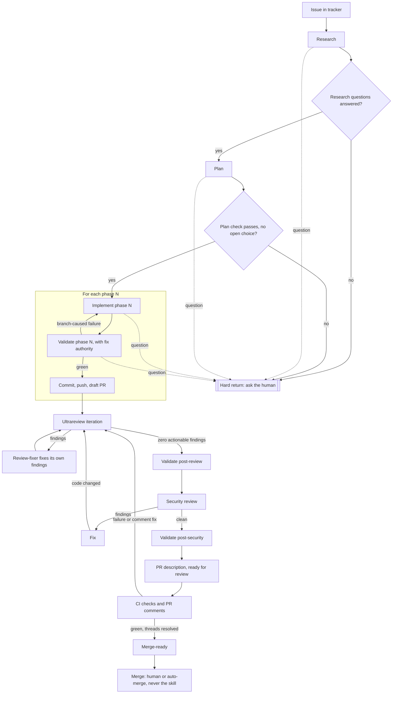

# Spec-Driven Development for Coding Agents

This is the process I use to take one issue from the tracker to a verified,
merge-ready pull request with coding agents. It is a set of skills, subagents,
validator scripts and document templates. The agent researches the code, writes
a phased plan, implements and independently validates each phase, loops a
multi-pass review until it is clean, runs a security review, and finalizes the
PR. Whenever a decision needs a human, it stops and asks.

It is a copy of the process I run in production, with product names, internal
paths and tooling replaced by placeholders such as `{{ARCHITECTURE_GUIDE}}`.
Last updated 2026-10-06. Background:
[My spec-driven development process](https://addcommitpush.io/brain/spec-driven-development-process-2026-10).

Credit: the research, plan, implement and validate commands descend from
HumanLayer's open-source Claude Code commands (Dex Horthy and the AI That Works
community). This toolkit adds the orchestrator, the question contract, the
validators and the ultrareview loop.

## If you are a human

You do not install this by hand. Point your coding agent (Claude Code, Codex,
Cursor or similar) at this folder and tell it to copy and recreate all of it in
your repository. Paste this:

```text
Read spec-driven-development/README.md and follow "If you are an AI agent".
Copy the skills, agents, scripts and templates into this repository, install
them as skills and subagents for our agent tool, and fill in every placeholder
from our repo (architecture docs, security docs, commands, issue tracker).
Ask me only for values you cannot find.
```

You need a repository with a git remote, the GitHub CLI (`gh`) logged in, and
a CLI or API for your issue tracker. The workflow gets much better when you
have an architecture document and a security document for it to check
against; if you have neither, write those first.

Once it is installed, use it like this:

- **One issue, end to end:** "develop ENG-123" (or `/develop-issue ENG-123`).
  The agent runs every stage and ends with a non-draft PR. It never merges.
- **When it stops with a question:** open the research doc or plan it names,
  answer inline (`Answer: b`), and tell the agent to continue.
- **One stage at a time:** call `research-codebase`, `create-plan`,
  `implement-plan`, `validate-plan` or `ultrareview` directly.
- **Merging** is yours, or your auto-merge rule's.

## If you are an AI agent: how to recreate this

Do these steps in order. Do not skip the placeholder audit at the end of step 3.

### 1. Copy this into the repository

Read this README fully, then `skills/develop-issue/SKILL.md` and its two
`references/` files. They define the contract every other file serves. Then
copy the folder's contents into the target repository:

- `scripts/*` to a scripts directory, for example `scripts/specdd/`. That
  path becomes `{{SCRIPTS_DIR}}`. Run `chmod +x` on the scripts.
- `templates/*` next to the scripts or under the thoughts directory.
- `skills/*` and `agents/*` as described in step 2.

### 2. Install the skills and subagents

Find which agent tool(s) the repository uses and install into their locations:

| Tool | Skills | Subagents |
|---|---|---|
| Claude Code | `.claude/skills/<name>/SKILL.md` | `.claude/agents/<name>.md` |
| Codex | `.agents/skills/<name>/SKILL.md` (keep `agents/openai.yaml`) | `.codex/agents/<name>.toml` with `name`, `description`, `sandbox_mode`, `developer_instructions` |
| Cursor | `.cursor/rules/` | `.cursor/agents/<name>.md` |
| Other | the tool's reusable-instruction location | the tool's named-subagent location |

Copy each `skills/<name>/` folder whole, including `references/`. If the
repository uses several tools, keep one source copy and symlink the others. If
the repository already has older versions of these skills, commands or agents
(for example `.claude/commands/create_plan.md`), replace them; do not keep two
versions side by side.

### 3. Fill in the placeholders

Every `{{TAG}}` in the installed files must become a real value from the target
repository. The [template tags table](#template-tags) lists them all. Work
through them in this order:

1. **Docs the agent checks against.** `{{AGENTS_FILE}}`,
   `{{ARCHITECTURE_GUIDE}}`, `{{SERVICE_GUIDES}}`, `{{SECURITY_GUIDE}}`. Search
   for `AGENTS.md`, `CLAUDE.md`, `ARCHITECTURE.md`, `SECURITY.md`, `docs/` and
   per-service READMEs. Use the real paths.
2. **Branch and commands.** `{{DEFAULT_BRANCH}}`, `{{CHECK_COMMAND}}`,
   `{{TEST_COMMAND}}`, `{{LINT_COMMAND}}`, `{{E2E_COMMAND}}`,
   `{{CODEGEN_COMMAND}}`. Read `package.json`, `Makefile`, `justfile`,
   `Taskfile` and CI config.
3. **Artifact paths.** `{{THOUGHTS_DIR}}`, `{{RESEARCH_DIR}}`, `{{PLANS_DIR}}`,
   `{{REVIEWS_DIR}}`, `{{SCRATCH_DIR}}`, `{{SCRIPTS_DIR}}`. Reuse existing
   folders if the repo has them; otherwise use the example values. Create the
   directories and git-ignore `{{SCRATCH_DIR}}`.
4. **Issue tracker.** `{{ISSUE_PREFIX}}` and the four `{{ISSUE_*_COMMAND}}`
   tags. Write small scripts or CLI calls that meet the contract in
   `skills/issue-tracker/SKILL.md`.
5. **Optional.** `{{SECURITY_SKILL}}`, `{{DEMO_RECORDING_GUIDE}}`.

Ask the human only for values you cannot find, usually the tracker commands and
the issue prefix. When the repository has no equivalent (no end-to-end suite,
no code generation), delete or rewrite that sentence; never leave a tag behind.
Finish with `grep -rn "{{" <installed paths>`. It must return nothing.

### 4. Verify

- `bash {{SCRIPTS_DIR}}/validate-research-structure.sh templates/research.md`
  exits 0, and exits 1 with `--require-answers` (the sample Q1 is unanswered).
- `bash {{SCRIPTS_DIR}}/validate-plan-structure.sh templates/plan.md` exits 0.
- Run one small issue end to end with `develop-issue`. Confirm it stops at
  research questions, resumes after the human answers, keeps one draft PR
  updated per phase, converges ultrareview, and ends with a non-draft PR that
  it did not merge.

## The loop



Plain text:

```text
issue (tracker)
  -> research ----------------------------> research questions answered? --no--> HARD RETURN
  -> plan --------------------------------> plan check passes?           --no--> HARD RETURN
  -> for each phase N:
       implement <-> validate (fix authority) -> commit + push + draft PR
  -> ultrareview <-> review-fixer   (repeat until one full pass has zero findings)
  -> validate (post-review)
  -> security review <-> fix        (code changed? back to ultrareview)
  -> validate (post-security)
  -> PR description + ready for review
  -> CI + PR comments               (fixes invalidate review/validation; loop back)
  -> merge-ready
  -> merge                          (human or auto-merge, never by the skill)

HARD RETURN can fire from any stage: write the question into the owning
artifact, validate its shape, stop every later stage, end the turn.
```

## Stage by stage

| Stage | Skill(s) | Subagents used | Artifact produced | Advance gate |
|---|---|---|---|---|
| Orient | `develop-issue`, `issue-tracker` | none | State ledger in `{{SCRATCH_DIR}}` | Scope known, no unanswered question |
| Research | `research-codebase` | codebase-locator, codebase-analyzer, codebase-pattern-finder, thoughts-locator, thoughts-analyzer, web-search-researcher | `{{RESEARCH_DIR}}/<ts>_<issue>_<topic>.md` | `validate-research-structure.sh --require-answers` passes |
| Plan | `create-plan` (optionally `iterate-plan`) | codebase-locator, codebase-analyzer, codebase-pattern-finder, thoughts-locator, thoughts-analyzer | `{{PLANS_DIR}}/<ts>_<issue>_<name>.md` | `validate-plan-structure.sh` passes, no open choice |
| Phase implement | `implement-plan` | optional, for targeted debugging | Phase diff, `phase-N: implement` ticked | No planned item, gap, warning, or question left |
| Phase validate | `validate-plan` (fix authority) | codebase-locator, codebase-analyzer, codebase-pattern-finder | Validation report, `phase-N: validate` ticked | Required commands pass |
| Phase publish | `develop-issue` | none | Commit, push, one draft PR | Remote has the commit, `phase-N: commit-pr` ticked |
| Ultrareview | `ultrareview`, then `validate-plan` | ultrareview-review-fixer | `{{REVIEWS_DIR}}/<ts>_<issue>_<branch>_ultrareview.md` | One full iteration with zero actionable findings |
| Security | security review, then `validate-plan` | optional `{{SECURITY_SKILL}}` | Security report in `{{REVIEWS_DIR}}` | No actionable security finding on the current diff |
| Finalize | `pr-describe`, `pr-comment-resolution`, `issue-tracker` | none | PR body, comment report, one issue comment | Non-draft, conflict-free, threads resolved, required checks green |

## What is an ultrareview

A single review pass reads the diff once and reports. An ultrareview is a loop
that keeps reviewing until the code stops changing. The orchestrator reviews the
full branch against `origin/{{DEFAULT_BRANCH}}` (including uncommitted and
untracked files), not one commit. It opens a report file first, then runs up to
10 iterations. In each iteration it dispatches one generic subagent,
`ultrareview-review-fixer`, with a pass focus: architecture compliance first,
then intent fit, then detailed package, code-health, docs, and test review, then
final verification. Each subagent instance reviews its scope fully, writes its
findings to the report, fixes what it found in the same context, and records how.
There is no reviewer-to-fixer handoff, so context is never lost between finding
and fix.

The orchestrator inspects every entry and diff, runs validation, and decides.
When a change touches a contract or a runtime control flow, the review must
include an impact map (owners, producers, consumers, generated projections, test
doubles) and an exit-path matrix (success, error, cancellation, deadline,
partial work). The loop is `done` only when a complete iteration finds nothing
actionable and the certified snapshot (HEAD, working tree, untracked files)
still matches what was validated. Any later code change needs a new review.

## The implement and validate loop

Each plan phase is implemented by one fresh worker running `implement-plan` for
that phase only. A **different** worker then runs `validate-plan` for the same
phase with explicit authority to fix branch-caused blockers. Separating the two
means the validator has no stake in the implementation and re-runs every
automated criterion itself. Warnings count as failures. Only after both gates
pass does the orchestrator commit, push, and update the single draft PR, then
tick `phase-N: commit-pr`. Workers never commit, push, or touch the PR.

Invalidation rules keep evidence honest:

- issue or acceptance drift invalidates planning and everything downstream;
- any code change invalidates validation, clean ultrareview, security review,
  and exact-head evidence for the affected surfaces;
- a base update invalidates conflict and mergeability evidence;
- a push invalidates remote-head and CI evidence until GitHub confirms it;
- new PR feedback invalidates readiness until resolved.

Every command result is recorded with the stage, head, result, and a failure
class (branch-caused, pre-existing, infrastructure, unknown). A later green retry
does not erase the first failure.

## The question contract

The agent asks only when evidence cannot safely decide something that changes
product behavior, public compatibility, persisted data, security, external side
effects, or the PR boundary. Each question is written into the artifact that
owns it (research `## Open Questions`, plan `## Open Questions`, or a phase's
`### Implementation Questions`) in a fixed shape: `Q1.`, `Context:`,
`Research checked:`, `Why this requires user input:`, `Default if unanswered:`,
and single-line `Options:` with exactly one `[Recommended]`. After validating the
shape, the agent does a **hard return**: no further stages, no edits, no commits,
no tracker writes, end of turn. The recommended default is never auto-selected.
On resume, the answer is recorded inline (`Answer: <letter>`, `Resolution:`) and
work continues from the stage that asked.

## Template tags

| Tag | Description | Example value |
|---|---|---|
| `{{AGENTS_FILE}}` | Root agent instructions file | `AGENTS.md` or `CLAUDE.md` |
| `{{ARCHITECTURE_GUIDE}}` | Architecture entrypoint(s) and index of topic docs, including any reference implementation | `ARCHITECTURE.md` and `docs/architecture/README.md` |
| `{{SECURITY_GUIDE}}` | Security rules the security review checks against | `SECURITY.md` |
| `{{SECURITY_SKILL}}` | Optional language-level security skill | `$security-best-practices` |
| `{{SERVICE_GUIDES}}` | Map of service roots to their agent, architecture, code-pattern, and testing guides | `api/AGENTS.md`, `web/AGENTS.md`, `web/TESTING.md` |
| `{{DEFAULT_BRANCH}}` | Branch PRs target and diffs compare against | `main` |
| `{{ISSUE_PREFIX}}` | Issue identifier prefix | `ENG` (as in `ENG-123`) |
| `{{ISSUE_FETCH_COMMAND}}` | Prints one issue with all comments | `scripts/tracker/get-issue.sh` |
| `{{ISSUE_CONTEXT_COMMAND}}` | Prints the issue's project and sibling issues | `scripts/tracker/get-issue-context.sh` |
| `{{ISSUE_SEARCH_COMMAND}}` | Searches issues by text | `scripts/tracker/search-issues.sh` |
| `{{ISSUE_COMMENT_COMMAND}}` | Posts a comment on an issue | `scripts/tracker/comment-issue.sh` |
| `{{THOUGHTS_DIR}}` | Root of research, plans, reviews, and notes | `thoughts` |
| `{{RESEARCH_DIR}}` | Research documents | `thoughts/shared/research` |
| `{{PLANS_DIR}}` | Implementation plans | `thoughts/shared/plans` |
| `{{REVIEWS_DIR}}` | Ultrareview, security, and PR-comment reports | `thoughts/shared/reviews` |
| `{{SCRATCH_DIR}}` | Git-ignored orchestration state and PR body draft | `.context/develop-issue` |
| `{{SCRIPTS_DIR}}` | Where the validator and metadata scripts live | `scripts/specdd` |
| `{{CHECK_COMMAND}}` | Full service-level validation (lint, types, tests) | `make check` or `pnpm check` |
| `{{TEST_COMMAND}}` | Test runner, scoped to a package when possible | `go test ./...` or `pnpm test` |
| `{{LINT_COMMAND}}` | Linter(s), including any repo-local linter | `make lint` |
| `{{E2E_COMMAND}}` | End-to-end test suite | `pnpm test:e2e` |
| `{{CODEGEN_COMMAND}}` | The one allowed code/SDK generation command | `make generate` |
| `{{DEMO_RECORDING_GUIDE}}` | How to record and upload one demo video for visual changes | `docs/recording-demos.md` |

## Folder map

```text
spec-driven-development/
  README.md
  skills/
    develop-issue/            orchestrator: issue to merge-ready PR
      SKILL.md
      references/stage-contracts.md
      references/question-contract.md
      agents/openai.yaml      Codex skill UI metadata
    research-codebase/        research document with open questions
    create-plan/              phased plan with Execution Status
    iterate-plan/             read-only plan status and next-delta patch
    implement-plan/           implement one phase
    validate-plan/            verify a phase or checkpoint, optional fix authority
    ultrareview/              iterative review-fix loop
    pr-describe/              PR body from local git state
    pr-comment-resolution/    fetch, analyze, fix, and report PR comments
    issue-tracker/            tracker contract: fetch, context, search, comment
  agents/
    codebase-locator.md       where code lives
    codebase-analyzer.md      how code works
    codebase-pattern-finder.md  existing patterns to model after
    thoughts-locator.md       which thoughts documents exist
    thoughts-analyzer.md      insights from a thoughts document
    web-search-researcher.md  external docs with links
    ultrareview-review-fixer.md generic review-then-fix shell
  scripts/
    validate-research-structure.sh  Open Questions shape and answers
    validate-plan-structure.sh      phase headings vs Execution Status
    spec-metadata.sh                date, commit, branch, filename timestamp
  templates/
    research.md               passes the research validator
    plan.md                   passes the plan validator
```
